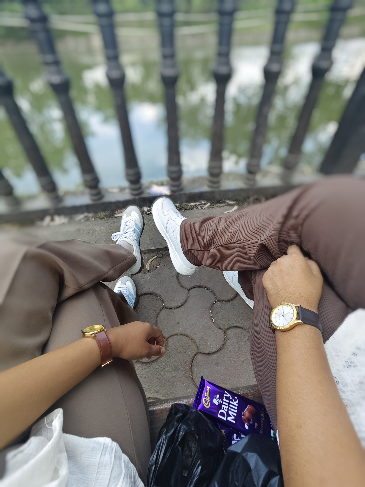

<!DOCTYPE html>
<html lang="en">
<head>
    <meta charset="UTF-8">
    <meta name="viewport" content="width=device-width, initial-scale=1.0">
    <title>Happy 1st Anniversary, Sanaa!</title>
    
</head>
<body>

    

    <header>
        
TO MY DEAREST SANAA

        <h1>Happy 1st Anniversary</h1>
        
Our beautiful journey began 365 days ago.

        
👇

    </header>

    

        

            <h2 style="color: var(--primary-pink);">My Favorite Year</h2>
            
Sanaa, this past year has been a dream come true. From our very first date to the small everyday moments, every second spent with you is a memory I cherish.

            
Thank you for your kindness, your laughter, and for being the incredible person you are. I'm so lucky to call you mine.

        

    

    

        <h2 style="margin-bottom: 30px;">365 Days of Us</h2>
        

            
            
            
        

    

    

        

            <button id="gift-button" onclick="revealSecret()">🎁 Click for a Secret Message</button>
            

                

                    <h3 style="color: var(--primary-pink);">My Promise To You</h3>
                    
No matter where life takes us, I promise to always hold your hand, listen to your stories, and love you more each day.

                    
❤️ Forever & Always ❤️

                

            

        

    

    <footer>
        
Made with love for Sanaa

        
&copy; 2025 - 2026 Our First Year

    </footer>

    
</body>
</html>
